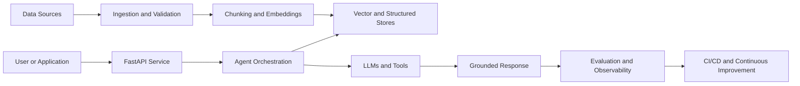

# Hi, I'm Swapnil Parate 👋

### Applied AI Engineer | Generative AI · RAG · Agentic Systems · MLOps

I build production-oriented AI systems that combine retrieval-augmented generation, agentic workflows and practical MLOps. My work covers Python, LangGraph, LangChain, FastAPI, Docker, Kubernetes, MLflow, CI/CD, observability and cloud deployment.

I focus on the full path from an AI idea to a reliable system: data ingestion, retrieval, orchestration, evaluation, API development, containerization, automated delivery and monitoring.

---

## What I can build

- **Grounded RAG systems** with document ingestion, chunking, embeddings, vector search, contextual answers and source-aware responses.
- **Agentic AI workflows** with tools, shared state, routing, multi-step reasoning and human-in-the-loop control.
- **Production AI APIs** using Python and FastAPI, with modular services, validation, testing and structured outputs.
- **Evaluation pipelines** for retrieval quality, response quality, groundedness, latency, cost and regression detection.
- **MLOps platforms** with experiment tracking, model versioning, reproducible pipelines and automated deployment.
- **Cloud-native AI services** packaged with Docker, orchestrated with Kubernetes and delivered through CI/CD.

## Technology stack

**AI and orchestration:** LangGraph · LangChain · RAG · LLM applications · Agentic AI · NLP  
**Backend and data:** Python · FastAPI · SQL · Vector databases · REST APIs  
**MLOps and infrastructure:** MLflow · Docker · Kubernetes · GitHub Actions · CI/CD · Observability  
**Cloud:** AWS · cloud-native deployment patterns

---

## Flagship projects

### [Enterprise RAG System](https://github.com/swapnilparate87/Enterprise-RAG-System)

A production-oriented retrieval-augmented generation system for turning enterprise documents into grounded, context-aware answers.

**What it demonstrates:** RAG architecture, ingestion and retrieval pipelines, vector search, LLM integration, modular Python development and application delivery.

### [Multi-Agent AI Travel Planner](https://github.com/swapnilparate87/Let-s-Trip-AI---A-Multi-Agent-Travel-Planner)

A multi-agent system designed to coordinate specialized AI components for travel research and itinerary planning.

**What it demonstrates:** agent decomposition, orchestration, tool-enabled workflows, state management and collaborative reasoning.

### [MLOps Capstone Project](https://github.com/swapnilparate87/MLOps-Capstone_Project)

An end-to-end machine-learning lifecycle project focused on reproducibility, experiment tracking, automation and production delivery.

**What it demonstrates:** MLflow, pipeline design, containerization, CI/CD and operational ML practices.

---

## How I design AI systems

The goal is not just to make an LLM respond. The goal is to make the complete system measurable, reproducible, explainable and deployable.

---

## More engineering work

- [Vehicle Insurance MLOps Project](https://github.com/swapnilparate87/MLOPS-Project1-Vehicle_Insurance_Domain-) — domain-focused ML pipeline and production workflow.
- [Bayesian Optimization for Fan/Blower Performance](https://github.com/swapnilparate87/Bayesian-Optimization-for-Efficient-Fan-Blower-Performance-Tuning-) — data-driven optimization for engineering performance tuning.
- [Multi-Agent System](https://github.com/swapnilparate87/Multi_Agent_System) — experiments with coordinated AI agents and workflow design.

## Currently building

I am developing an evaluation-focused agentic AI project to measure task success, grounding, tool-use reliability, latency, cost and failure modes. It will connect agent development with the engineering discipline needed to ship dependable LLM applications.

---

## Engineering principles

- Evaluate before claiming improvement.
- Design for failure, retries and observability.
- Prefer grounded answers over confident hallucinations.
- Automate repeatable workflows.
- Treat deployment and monitoring as part of the product.
- Build public evidence through architecture, tests, metrics and working code.

## Connect

- GitHub: [@swapnilparate87](https://github.com/swapnilparate87)
- Explore my repositories and open an issue if you would like to discuss a project or collaborate.
